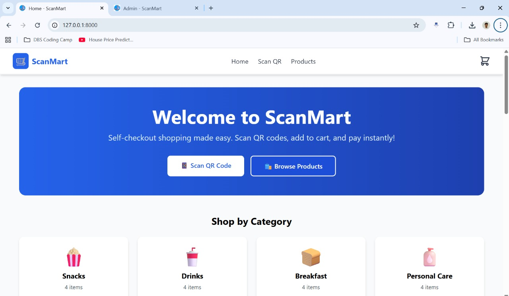
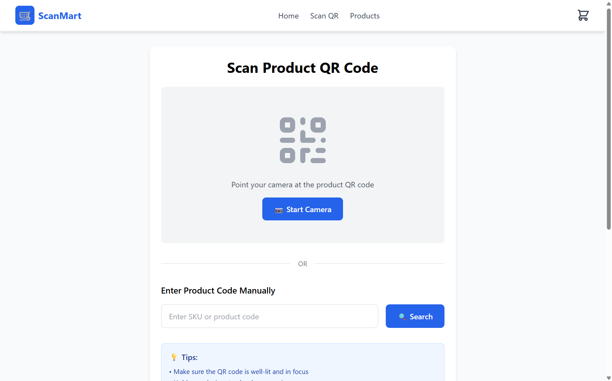
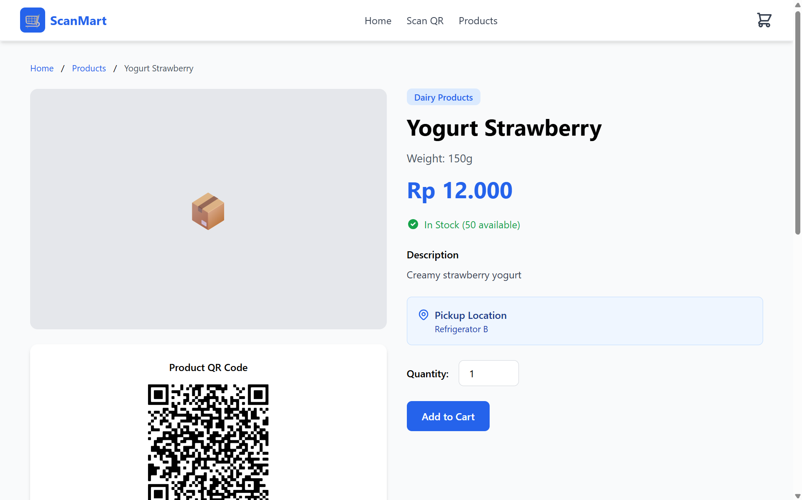
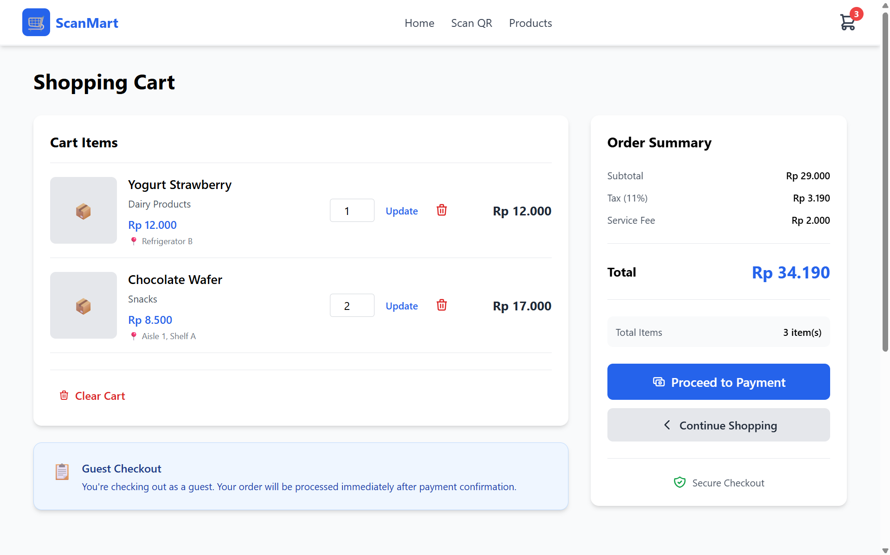
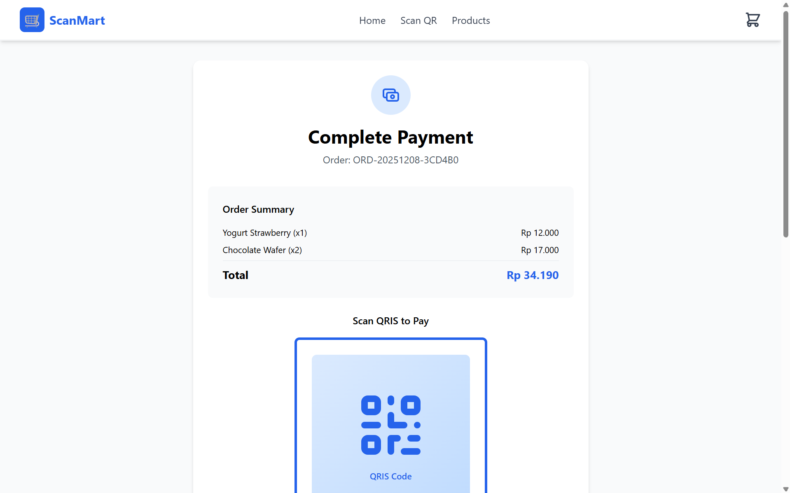
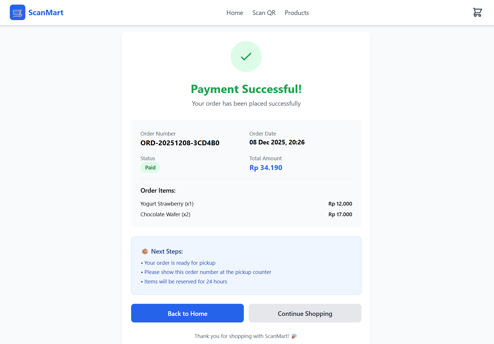
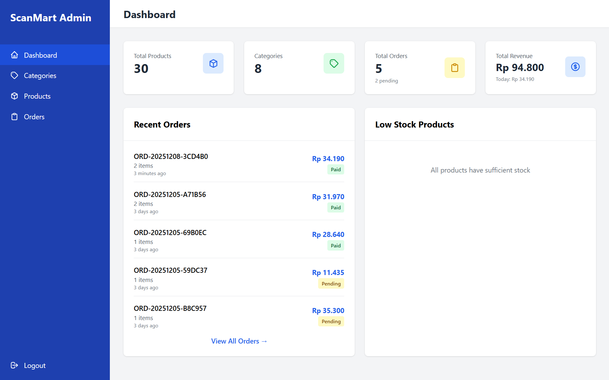
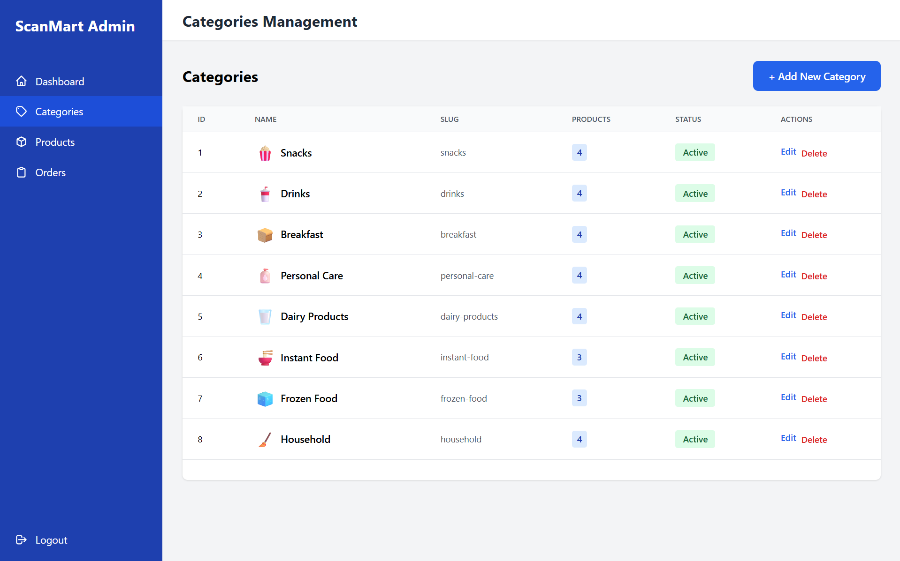
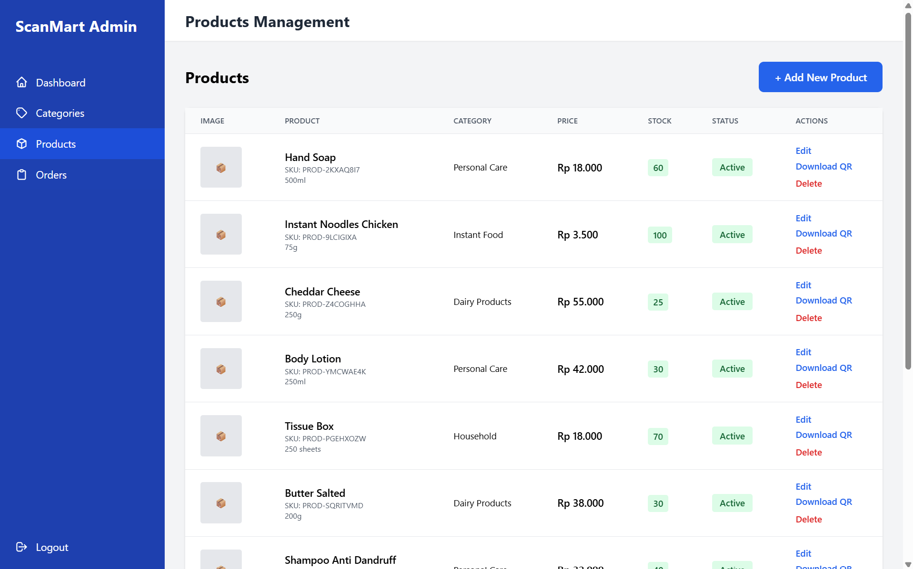
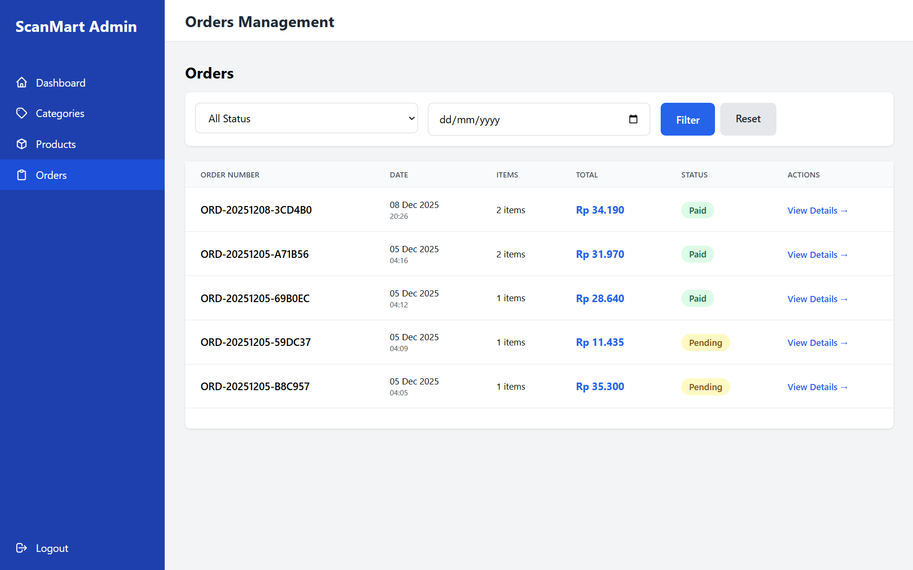

# 🛒 ScanMart - Self-Checkout Shopping System


> Modern self-checkout shopping solution with QR Code technology for retail stores. Shop smarter, faster, and skip the queue!

---

## Table of Contents

- [About](#about)
- [Features](#features)
- [Tech Stack](#tech-stack)
- [Screenshots](#screenshots)
- [Installation](#installation)
- [Usage](#usage)
- [Project Structure](#project-structure)
- [API Documentation](#api-documentation)
- [Contributing](#contributing)
- [License](#license)
- [Authors](#authors)

---

## About

**ScanMart** is an innovative self-checkout system designed to revolutionize the retail shopping experience. By leveraging QR Code technology, customers can scan products, manage their digital cart, and complete payments seamlessly without traditional cashier interactions.

This project was developed as part of the **Information Systems and Technology Innovation** course at Universitas Airlangga, demonstrating the practical application of modern web technologies in solving real-world retail challenges.

### Problem Statement

Traditional shopping experiences face several challenges:
- Long queues at checkout counters
- Time-consuming manual payment processes
- Limited staff efficiency during peak hours
- Poor customer experience due to waiting times

### Our Solution

ScanMart addresses these issues by:
- Enabling instant product information via QR scanning
- Providing seamless guest checkout experience
- Automating inventory management
- Reducing operational costs for retailers
- Supporting SDG Goal 9: Industry, Innovation, and Infrastructure

---

## Features

### Customer Features

#### Product Discovery
- **Smart Product Catalog**: Browse products with advanced filtering and search
- **Category Navigation**: Organized product categories with emoji icons
- **Real-time QR Scanner**: Scan product QR codes using device camera
- **Product Details**: Comprehensive information including price, stock, weight, and pickup location
- **Related Products**: Smart recommendations based on category

#### Shopping Experience
- **Guest Checkout**: No registration required - shop immediately
- **Digital Shopping Cart**: Real-time cart management with quantity updates
- **Auto Calculations**: Automatic tax (11%) and service fee calculations
- **Stock Validation**: Real-time stock checking before purchase
- **Multiple Add Methods**: QR scan or manual SKU input

#### Payment Process
- **QRIS Simulation**: Demo payment with QR code display
- **Order Summary**: Detailed breakdown of charges
- **Instant Confirmation**: Immediate order confirmation with order number
- **Order Receipt**: Digital receipt with complete transaction details

### Admin Features

#### Dashboard Analytics
- **Real-time Statistics**: Products, categories, orders, and revenue tracking
- **Recent Orders**: Monitor latest transactions
- **Low Stock Alerts**: Automatic notification for products needing restock
- **Revenue Insights**: Today's and total revenue display

#### Product Management
- **Full CRUD Operations**: Create, Read, Update, Delete products
- **Automatic QR Generation**: SVG QR codes auto-generated for each product
- **Image Upload**: Product image management
- **Bulk Operations**: Toggle status, download QR codes
- **Stock Tracking**: Real-time inventory monitoring

#### Category Management
- **Category Organization**: Structured product categorization
- **Emoji Icons**: Visual category representation
- **Product Count**: Track products per category
- **Status Control**: Enable/disable categories

#### Order Management
- **Order Tracking**: View all customer orders
- **Advanced Filtering**: Filter by status, date
- **Order Details**: Complete order information with item breakdown
- **Status Updates**: Mark orders as paid
- **Automatic Stock Updates**: Inventory adjusted upon payment confirmation

---

## Tech Stack

### Backend
- **Framework**: Laravel 12 (PHP 8.3)
- **Database**: MySQL 8.0
- **Authentication**: Session-based admin authentication
- **Storage**: Laravel Storage (File System)

### Frontend
- **Template Engine**: Blade (Laravel)
- **CSS Framework**: Tailwind CSS 3.4
- **Build Tool**: Vite 5
- **Icons**: Lucide Icons, Emoji
- **QR Scanner**: Html5-QRCode 2.3.8

### Development Tools
- **Local Server**: Laragon (Windows)
- **Package Manager**: Composer, npm
- **Version Control**: Git
- **Code Quality**: PSR-12 Standards

### Key Libraries
- **QR Code Generation**: SimpleSoftwareIO/simple-qrcode
- **QR Code Scanning**: Html5-QRCode (CDN)
- **Responsive Design**: Tailwind CSS utilities

---

## Screenshots

### Customer Interface

#### Home Page

*Modern landing page with category navigation and featured products*

#### QR Scanner

*Real-time camera QR code scanning*

#### Product Detail

*Comprehensive product information with generated QR code*

#### Shopping Cart

*Interactive cart with real-time calculations*

#### Payment


*QRIS payment simulation interface*

### Admin Interface

#### Dashboard

*Analytics dashboard with key metrics*

#### Category Management

*Category CRUD*

#### Product Management

*Product CRUD with QR code management*

#### Order Details

*Detailed order information*

---

## Installation

### Prerequisites

Ensure you have the following installed:
- **PHP** >= 8.3
- **Composer** >= 2.5
- **Node.js** >= 18.0
- **npm** >= 9.0
- **MySQL** >= 8.0
- **Laragon** (Windows) or equivalent local server

### Step-by-Step Installation

#### 1️⃣ Clone Repository

```bash
git clone https://github.com/yourusername/scanmart.git
cd scanmart
```

#### 2️⃣ Install Dependencies

```bash
# Install PHP dependencies
composer install

# Install Node.js dependencies
npm install
```

#### 3️⃣ Environment Configuration

```bash
# Copy environment file
cp .env.example .env

# Generate application key
php artisan key:generate
```

#### 4️⃣ Database Setup

Edit `.env` file:

```env
DB_CONNECTION=mysql
DB_HOST=127.0.0.1
DB_PORT=3306
DB_DATABASE=scanmart
DB_USERNAME=root
DB_PASSWORD=
```

Create database:
```bash
# Via MySQL CLI
mysql -u root -p
CREATE DATABASE scanmart;
EXIT;
```

#### 5️⃣ Run Migrations & Seeders

```bash
# Run migrations
php artisan migrate

# Seed database with sample data
php artisan db:seed

# Or combine both
php artisan migrate:fresh --seed
```

**Sample Data Included:**
- 8 product categories (Snacks, Drinks, Breakfast, etc.)
- 30 products with auto-generated QR codes
- Complete product information (price, stock, descriptions)

#### 6️⃣ Storage Link

```bash
# Create symbolic link for file storage
php artisan storage:link
```

#### 7️⃣ Build Assets

```bash
# Development mode (watch for changes)
npm run dev

# Production mode (minified)
npm run build
```

#### 8️⃣ Start Development Server

```bash
# Terminal 1: Laravel server
php artisan serve

# Terminal 2: Vite dev server (keep running)
npm run dev
```

**Access Application:**
- **Customer**: http://localhost:8000
- **Admin**: http://localhost:8000/admin/login

---

## 🎮 Usage

### Customer Flow

#### 1. Browse Products
```
Home → Products → Select Category or Search
```

#### 2. Scan QR Code (Optional)
```
Scan QR → Camera Permission → Point at QR → Auto-detect
```

#### 3. Add to Cart
```
Product Detail → Choose Quantity → Add to Cart
```

#### 4. Checkout
```
Cart → Review Items → Proceed to Checkout
```

#### 5. Payment
```
Checkout → Payment Page → "I Have Paid" → Success
```

### Admin Flow

#### 1. Login
```
/admin/login → Password: admin123 → Dashboard
```

#### 2. Manage Products
```
Products → Add New Product → Fill Form → Save
→ QR Code auto-generated!
```

#### 3. Download QR Codes
```
Products → Download QR → Print → Attach to physical products
```

#### 4. Monitor Orders
```
Orders → Filter by Status → View Details → Mark as Paid
```

---

## Project Structure

```
scanmart/
├── app/
│   ├── Http/
│   │   ├── Controllers/
│   │   │   ├── Customer/
│   │   │   │   ├── HomeController.php
│   │   │   │   ├── ProductController.php
│   │   │   │   ├── CartController.php
│   │   │   │   └── CheckoutController.php
│   │   │   └── Admin/
│   │   │       ├── DashboardController.php
│   │   │       ├── CategoryController.php
│   │   │       ├── ProductController.php
│   │   │       └── OrderController.php
│   │   └── Middleware/
│   │       └── AdminMiddleware.php
│   └── Models/
│       ├── Category.php
│       ├── Product.php
│       ├── Cart.php
│       ├── Order.php
│       └── OrderItem.php
├── database/
│   ├── migrations/
│   │   ├── create_categories_table.php
│   │   ├── create_products_table.php
│   │   ├── create_carts_table.php
│   │   ├── create_orders_table.php
│   │   └── create_order_items_table.php
│   └── seeders/
│       ├── CategorySeeder.php
│       └── ProductSeeder.php
├── resources/
│   ├── css/
│   │   └── app.css
│   ├── js/
│   │   └── app.js
│   └── views/
│       ├── layouts/
│       │   ├── customer.blade.php
│       │   └── admin.blade.php
│       ├── customer/
│       │   ├── home.blade.php
│       │   ├── scan.blade.php
│       │   ├── products/
│       │   ├── cart/
│       │   └── checkout/
│       └── admin/
│           ├── dashboard.blade.php
│           ├── categories/
│           ├── products/
│           └── orders/
├── routes/
│   └── web.php
├── storage/
│   └── app/
│       └── public/
│           ├── products/      # Product images
│           └── qrcodes/       # Generated QR codes
├── .env.example
├── composer.json
├── package.json
├── tailwind.config.js
├── vite.config.js
└── README.md
```

---

## API Documentation

### Admin Authentication

#### Simple Session-Based Auth
```php
// Login
POST /admin/login
Body: { password: "admin123" }
Response: Redirect to /admin

// Logout
POST /admin/logout
Response: Redirect to /
```

### Product Routes

```php
// Customer
GET  /products              // List all products
GET  /product/{slug}        // Product detail
POST /cart/add              // Add to cart
POST /search-code           // Search by SKU

// Admin
GET  /admin/products        // List products
POST /admin/products        // Create product
GET  /admin/products/{id}/edit
PUT  /admin/products/{id}   // Update product
DELETE /admin/products/{id} // Delete product
```

### Order Routes

```php
// Customer
POST /checkout/process      // Create order
GET  /checkout/payment/{orderNumber}
POST /checkout/confirm/{orderNumber}
GET  /checkout/success/{orderNumber}

// Admin
GET  /admin/orders          // List orders
GET  /admin/orders/{id}     // Order detail
POST /admin/orders/{id}/status // Update status
```

---

## Testing

### Manual Testing Checklist

Run comprehensive tests:

```bash
# 1. Customer Flow
✓ Browse products with filters
✓ Scan QR code with camera
✓ Add products to cart
✓ Update cart quantities
✓ Complete checkout process
✓ View order success page

# 2. Admin Flow
✓ Login to admin panel
✓ View dashboard statistics
✓ Create/Edit/Delete categories
✓ Create/Edit/Delete products
✓ Download QR codes
✓ View and manage orders
✓ Mark orders as paid
✓ Verify stock updates

# 3. Edge Cases
✓ Out of stock products
✓ Empty cart checkout
✓ Invalid SKU search
✓ Duplicate cart items
✓ Admin access without login
```

### Testing Tools

```bash
# Clear cache before testing
php artisan cache:clear
php artisan view:clear
php artisan config:clear

# Reset database
php artisan migrate:fresh --seed

# Check logs
tail -f storage/logs/laravel.log
```

---

## Contributing

We welcome contributions! Please follow these guidelines:

### How to Contribute

1. **Fork** the repository
2. **Create** your feature branch
   ```bash
   git checkout -b feature/AmazingFeature
   ```
3. **Commit** your changes
   ```bash
   git commit -m 'Add some AmazingFeature'
   ```
4. **Push** to the branch
   ```bash
   git push origin feature/AmazingFeature
   ```
5. **Open** a Pull Request

### Code Standards

- Follow **PSR-12** coding standards
- Write **descriptive commit messages**
- Add **comments** for complex logic
- Update **documentation** when needed
- Test your changes thoroughly

### Reporting Issues

Found a bug? Please open an issue with:
- Clear description
- Steps to reproduce
- Expected vs actual behavior
- Screenshots (if applicable)

---

## 📄 License

This project is licensed under the **MIT License** - see the [LICENSE](LICENSE) file for details.

```
MIT License

Copyright (c) 2025 ScanMart Team

Permission is hereby granted, free of charge, to any person obtaining a copy
of this software and associated documentation files (the "Software"), to deal
in the Software without restriction, including without limitation the rights
to use, copy, modify, merge, publish, distribute, sublicense, and/or sell
copies of the Software, and to permit persons to whom the Software is
furnished to do so, subject to the following conditions:

The above copyright notice and this permission notice shall be included in all
copies or substantial portions of the Software.

THE SOFTWARE IS PROVIDED "AS IS", WITHOUT WARRANTY OF ANY KIND, EXPRESS OR
IMPLIED, INCLUDING BUT NOT LIMITED TO THE WARRANTIES OF MERCHANTABILITY,
FITNESS FOR A PARTICULAR PURPOSE AND NONINFRINGEMENT. IN NO EVENT SHALL THE
AUTHORS OR COPYRIGHT HOLDERS BE LIABLE FOR ANY CLAIM, DAMAGES OR OTHER
LIABILITY, WHETHER IN AN ACTION OF CONTRACT, TORT OR OTHERWISE, ARISING FROM,
OUT OF OR IN CONNECTION WITH THE SOFTWARE OR THE USE OR OTHER DEALINGS IN THE
SOFTWARE.
```

---

## 👥 Authors

**ScanMart Team - Kelompok 1**

| Name | NIM | Role | GitHub |
|------|-----|------|--------|
| Hasan Fadhlurrahman | 187231071 | Full Stack Developer | [@hasanfadh](#) |
| Frisqi Firmansyah Haren Mongilong | 187231086 | UI/UX Designer | [@frisqifirmansyah](#) |
| Muhammad Jiydan Salman Alfarisiy | 187231091 | Frontend Developer | [@muhammadjiydan](#) |

**Academic Supervisor:**
- Course: Information Systems and Technology Innovation
- Institution: Universitas Airlangga
- Faculty: Science and Technology
- Department: Information Systems

---

## Acknowledgments

Special thanks to:

- **Laravel Community** - For excellent documentation and support
- **Tailwind CSS Team** - For the amazing utility-first CSS framework
- **Html5-QRCode Contributors** - For the reliable QR scanning library
- **Open Source Community** - For all the tools and libraries that made this possible

---

## Contact & Support

- **Project Repository**: [github.com/yourusername/scanmart](https://github.com/yourusername/scanmart)
- **Issues**: [github.com/yourusername/scanmart/issues](https://github.com/yourusername/scanmart/issues)
- **Email**: hasan.fadlurrahman@gmail.com

---

## Roadmap

### Version 2.0 (Planned)

- [ ] **User Authentication**: Customer login and profile management
- [ ] **Real Payment Gateway**: Midtrans/Xendit integration
- [ ] **Order History**: Customer order tracking
- [ ] **Product Reviews**: Rating and review system
- [ ] **Wishlist**: Save favorite products
- [ ] **Multi-language**: Support for Indonesian and English
- [ ] **Mobile App**: React Native mobile application
- [ ] **Analytics**: Advanced reporting and insights
- [ ] **Promotions**: Discount codes and special offers
- [ ] **Inventory Alerts**: Email notifications for low stock

### Future Enhancements

- [ ] **AI Recommendations**: Machine learning product suggestions
- [ ] **Voice Search**: Voice-activated product search
- [ ] **AR Preview**: Augmented reality product preview
- [ ] **Social Sharing**: Share products on social media
- [ ] **Loyalty Program**: Points and rewards system

---

## Project Statistics

- **Lines of Code**: ~5,000+
- **Development Time**: 4 weeks
- **Contributors**: 3 developers
- **Database Tables**: 8 tables
- **API Endpoints**: 20+ routes
- **UI Components**: 20+ Blade views
- **Test Coverage**: Manual testing completed

---

<div align="center">

### 🌟 Star this repository if you find it helpful!

Made with ❤️ by ScanMart Team | Universitas Airlangga © 2025

[⬆ Back to Top](#-scanmart---self-checkout-shopping-system)

</div>